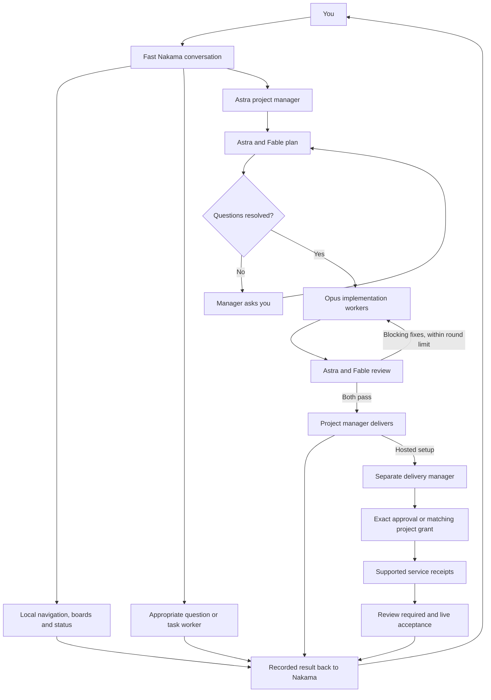

# Talk to Nakama, meet the workers

Nakama is the face and voice you speak to. Its fast interaction role is separate from the agents doing deeper work. You can ask for progress or move around the app while a project is being planned, implemented or reviewed.

The app uses real saved jobs and bounded workflows; it does not start extra model calls merely to animate an office or choose a name.

An exhausted fix limit returns an unfinished result needing attention; it is not an endless retry loop.

## How a request travels

| Your request | What happens |
| --- | --- |
| A supported local command, such as opening a page or completing a card | Nakama validates the direct command and performs the local operation without model inference |
| Short ordinary conversation | The separately configured fast interaction model answers |
| Detailed question, research or specialist work | The existing appropriate deeper role handles the work and returns its recorded result |
| An action or routine | Supported deterministic routines are saved locally; other actions use the existing validated task planner and permissions |
| A selected-project build | A project manager coordinates Astra/Fable planning, required user answers, Opus implementation and dual review |
| A hosted website request | Saved setup questions precede planning; a separate delivery manager can follow dual review and pauses for exact approval or missing answers |

Requests that cannot be safely recognised do not become arbitrary executable commands. Account/model failures, missing permissions and unresolved questions stay visible. A weather lookup link is still a lookup link, not a claim to have retrieved current weather.

For background work, the acknowledgement means that Nakama accepted and recorded the job. It is distinct from the final answer. Child work reports into the managed workflow; its manager delivers only when the required stages have succeeded. Local status queries read these records directly.

## Choose the front-facing model

Open **Settings → AI roles**. The interaction assignment starts with **ChatGPT GPT-6 Astra, low effort** and is saved separately from the deeper chat/planning/research/development assignments. The owner chose to keep this default until a faster suitable model is verified. There is no automatic model race or paid fallback.

Changing the interaction model does not change your project planners or implementation workers. Existing customised roles remain intact. Explicit supported per-request provider overrides and manual team controls remain available.

The deeper project defaults are Astra 6 Ultra, Fable 5.1 and Opus 4.8. New/restored Fable and Opus presets request Ultracode; restricted Claude execution maps that request to xhigh while Nakama coordinates tasks. Existing saved Fable max settings are preserved. See [project roles and account requirements](project-workflow.md).

Lower reasoning effort and local commands remove some avoidable delay. The official subscription client still starts/authenticates model requests, and network/account/model time varies. No end-to-end benchmark in this release establishes instantaneous replies or a fastest model. Detailed or safety-sensitive work must not be forced into a shallow response merely for speed.

## Read the Agent office

Open **Agent office** on Windows or Android. GPT mini Nakamas are **light green**, Claude mini Nakamas **orange**. Each sits at a little desk with a selectable screen. Provider text accompanies the colour so colour is not the only way to identify an agent.

Each newly recorded agent receives a cute generated name. It stays attached to that agent across refreshes and restart. Names come from an internal pool with collision handling; there is no normal UI for viewing or editing that pool. The names are labels, not separate accounts or independent identities with extra permissions.

The office distinguishes the project manager's orchestration record from the actual requests underneath it. Relationships come from saved workflow/task IDs. Queued work has not started; waiting for answers is not active implementation; failed, cancelled and interrupted work is not completed.

Select a screen to inspect the available assignment, provider/model, requested/effective effort, current recorded phase, output and error. A worker may have no output yet. The office shows recorded status and returned output, not hidden reasoning, continuous keystrokes or an invented terminal feed.

An eligible browser session associated with a real task can appear on its mini screen. Open **Nakama browser** for the full view or a private human takeover. This is the actual bounded browser snapshot, not a fabricated agent desktop. Private/tainted sessions and sessions controlled by a human are excluded from office previews. Current model adapters read text evidence; screenshot pixels are not passed as vision. See [browser modes and privacy](internal-browser.md).

Task-board completion is separate: manually checking a card does not complete its source worker. Use the project's Stop control or the existing activity controls to cancel supported work. Stopping cannot undo an external operation that already completed.

## Ask Nakama to navigate

Supported examples include “open agent office”, “go to projects”, “open routines”, “open core memory”, “open settings”, “open project setup”, “open delivery”, “open Nakama browser” and “go to the overview”. Use the app's visible names when a phrase is ambiguous. Some requests such as “show my tasks” or “show my routines” return board information on the host; “open the task board” or “open routines” explicitly asks to move there.

Navigation is a fixed set of app destinations, not an arbitrary URL or script. Only the immediate result of your own current request moves the requesting client. Refreshing or reading an old message must not replay it on another device. Windows still honours its unsaved-edit navigation guard.

On Android, local commands also cover supported system navigation and opening an installed app. Actions requiring accessibility use the existing visible, limited control session. A request to open Android settings does not change permissions or settings for you. Locked/protected screens and app restrictions still apply. See the exact supported phrases and setup in [Android navigation](android-guide.md).

## Privacy and completion

The office uses the same shared-data boundaries as task history. Google-disabled or project-disabled Android devices cannot read its agent details; an unrelated Chrome credential cannot use the office API. Losing permission clears access rather than retaining a stale private screen.

A delivery coordinator may be waiting for approval or finish at review required even after successful static development. Its receipts do not prove a live site. Attention notifications use generic text and refresh current state before navigation; private login content is never included.

The normal user still talks to Nakama. Agent names and coloured desks do not grant extra account access, approve deployments, enable video spending or bypass phone permissions. Core Memory remains visible and editable context, never authority to act.

For the first live team run and navigation checks, follow [the testing guide](testing-guide.md). Automated fixtures establish routing and UI behaviour; they do not establish real model quality, latency or physical-device navigation reliability.
