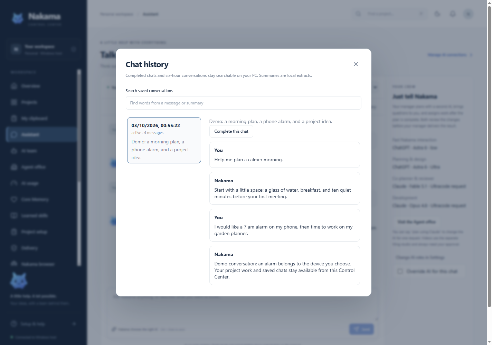

# Chat history and bounded memory

Nakama keeps chat originals on the Windows host. It groups messages by originating device and project. Ordinary conversations rotate after six hours measured from their first message. A local extract and the original transcript are saved together, then the old conversation leaves the visible timeline. Rotation also happens when an inactive conversation exceeds 500 visible messages. It does not call a model.

Successful action/build tasks and managed workflows close their associated conversation after final delivery is recorded. Ordinary discuss answers do not automatically close. Active tasks, waiting workflow questions and live local clarification prompts remain visible. The Complete button requires the exact current chat revision and refuses active work. Completed and archived conversations can be searched and read; this does not restart any work.

Summary generation is deterministic: up to six representative request/result pairs spread across the entire window, prioritizing stated decisions, requirements, deadlines, recorded outcomes and distinctive topics, with sensitive location/device-result and intermediate pipeline content omitted. These bounded extracts can omit details; the complete transcript remains searchable. They are historical data, not model-verified facts. Turning memory off still rotates the visible timeline and keeps its archive, but stops historical conversation context being supplied to models.

## Android local and offline history

Android local/offline exchanges have a separate **Local history** on that device, including wake clock replies. Active segments rotate after six hours or 32 message parts. Originals remain in app-private storage excluded from backup until you explicitly choose **Clear local history** for that scope. Long messages split losslessly into bounded parts; each file/read is bounded rather than silently deleting older conversations.

Local summaries select request/result excerpts from six chronological sections and prioritize decisions/deadlines/outcomes. Raw text and summaries are searchable. Search scans twenty segments per page; choose **Load older** to continue farther back. These are deterministic extracts and can omit detail; open the original transcript when it matters.

History is separated by host certificate fingerprint and paired device identity, with a separate unpaired local scope. An observed permission/authentication revocation hides that paired scope until an authorized snapshot returns. Local history is never uploaded to the host or inserted into model prompts. It follows the app's existing no-backup/no-transfer policy.

## Context budget

The real conversational provider path includes at most three scoped archive extracts and twelve bounded recent messages, with a hard 12,000-character history limit. It labels these as untrusted historical data. Full archived transcripts are never automatically inserted. Device/project scopes are exact; the desktop owner's ability to inspect another device's archive does not add that device's history to desktop model prompts. Typed action planning continues to exclude history so an old request cannot authorize a new action.

Managed pipeline stages continue to use their own bounded task evidence. Saving an archive is separate from preference learning: a model's output cannot silently become an authoritative user preference.

## API contract

- `GET /api/state` returns active `messages` with `chatId` and ISO `createdAt`, plus `chatHistory` metadata.
- `GET /api/chats?cursor=0&q=literal` returns up to 50 scoped metadata entries. Search is case-insensitive and checks raw transcript content and summary before pagination. `q` is limited to 200 characters; no regular expressions are executed.
- `GET /api/chats/:id` returns `{chat,messages}` containing the original transcript.
- `POST /api/chats/:id/complete` accepts `{revision}` and returns `{chat}`. A changed revision or active work returns HTTP 409.
- `POST /api/chats/receipts` accepts exact `taskIds`, `workflowIds` and/or `messageIds`, with at most 50 IDs per field. It returns matching accepted receipts from active and archived messages. It is read-only despite using POST for the bounded ID list.

Chat metadata includes `id`, numeric `revision`, `projectId`, `deliveryDeviceId`, `status` (`active`, `archived`, `completed`), `startedAt`, `updatedAt`, `messageCount`, `summary`, `summaryMethod: local_extract`, and `canComplete`. List responses include `rotationHours: 6` and nullable `nextCursor`.

Archive reads and completion follow both shared-personal permission grants. A paired device can only read its own source conversations. The desktop owner may inspect archives. Pending reply lookup is stricter: even the desktop owner retrieves only desktop-source receipts through that endpoint. Android rechecks pairing and permissions after fetching archived receipts and before speaking them. This keeps a completed final voice reply deliverable without keeping the completed chat visible or replaying the request.

Grouping, original-message movement, summary updates and revisions run inside the serialized store transaction. A persistence failure restores all of them together. Late final messages join the same archived group. Resumed active work reopens its group instead of being silently hidden.

## Verification

`tests/chat-history.test.mjs` covers six-hour rotation, active work and questions, explicit revision conflicts, automatic completion, late delivery/resumption, raw archive search, device/project isolation, disabled memory, bounded actual provider context, and save rollback/restart. Managed workflow regressions assert that one final manager delivery survives in archive receipts after disappearing from active chat. Android instrumentation fixtures cover archived final speech and access revocation; their execution status belongs in the build verification report.
