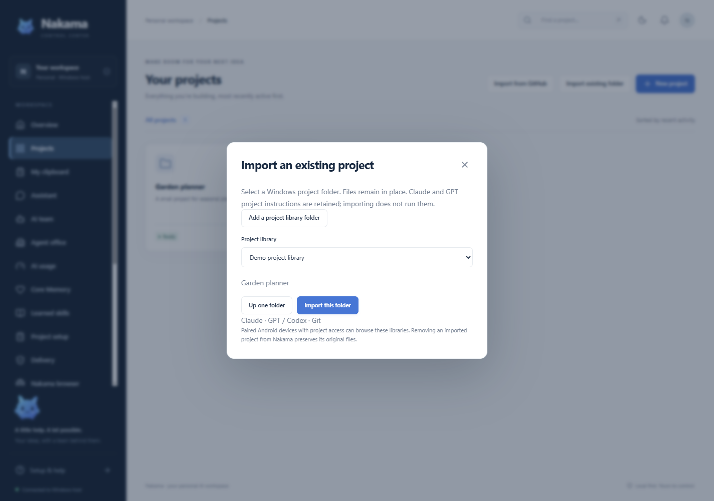
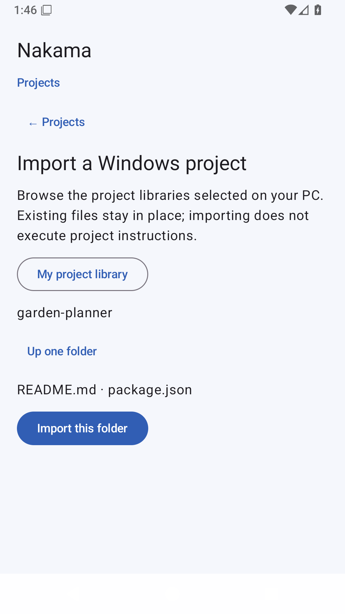

# Import an existing local project

Build 8 can register an existing Windows folder in Nakama without moving or copying its files. This works for local Codex/GPT and Claude Code projects, including folders containing AGENTS.md, CLAUDE.md or Git metadata. It does not import a cloud ChatGPT project or provider conversation history.

## Select a library on the PC

Open **Projects → Import existing folder → Add a project library folder**. Choose the parent containing your projects, such as a dedicated Development folder. Existing Nakama workspace projects are also browsable. Drive roots, Nakama's private state directory and its ancestors/descendants cannot become libraries.

Choose a library, open the desired folder, then choose **Import this folder**. The project appears in Nakama in place. Import does not execute instructions, run code, install dependencies, initialize Git or contact a model. Normal project operations retain their existing permissions and approvals.

## Browse from Android

Open **Projects → Import a Windows folder**. Select one of the libraries approved on the PC, navigate its folders and import the project. Android needs its existing shared project access. It cannot grant itself access to arbitrary Windows folders. Library names and relative folder paths are shown; private host-library configuration is not included in shared state.

Hidden/system folders, symbolic links and junction escapes are excluded. Import checks the resolved folder again before saving. Importing the same folder again returns its existing Nakama project. Removing an imported project from Nakama removes its registration and preserves its original files; review the removal approval text.

The root-removal API stops future browsing/import from that library. Already registered projects remain accessible under their existing project records until removed separately. Selecting a library is therefore an explicit sharing decision for permitted paired devices.
