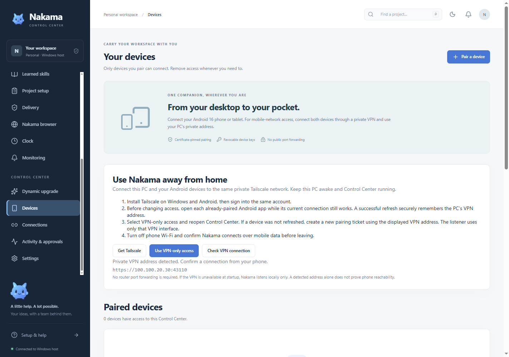

# Use Nakama away from home

The Windows host remains your PC. Keep it awake, online and running Nakama. Build 8 adds a guide in **Devices → Use Nakama away from home**, a listener bound only to the private VPN, and remembered trusted addresses on Android.

## One-time setup

1. Install Tailscale on the PC and every phone/tablet. Sign into the same private network and connect each device. Use the official [Windows installation guide](https://tailscale.com/docs/install/windows) and [Android installation guide](https://tailscale.com/docs/install/android).
2. In Nakama **Devices**, choose **Check VPN connection**. The guide should show the PC's private VPN address. Nakama detects the Tailscale interface; it does not install or sign into Tailscale for you.
3. **Before changing the listener**, open each already-paired Android app and refresh while its current home connection still works. It securely remembers the host's authenticated VPN address. This keeps the existing device identity and permissions.
4. On Windows choose **Use VPN-only access**, fully quit Nakama from its tray menu, then reopen it. The host binds to the detected VPN address. If Tailscale is unavailable at startup, Nakama listens locally only; connect Tailscale and restart Nakama.
5. For a new phone, or one that missed step 3, create a new Android pairing ticket using the VPN address shown in Devices. Preserve the host certificate check. Pair the tablet separately.
6. Turn off phone Wi-Fi and refresh Nakama over mobile data. Send a local host request, check its reply, and reconnect once before leaving home.

Tailscale connects enrolled devices using their private addresses; see its [quickstart](https://tailscale.com/docs/how-to/quickstart). This setup does not require a public website, public router port forwarding or an exit node. Your own VPN access rules and Windows firewall must allow the connection. Nakama does not silently rewrite either.

## What reconnecting does

Android stores up to four alternate HTTPS addresses learned from its authenticated host inside the encrypted pairing record. It tries a TLS-only certificate probe before choosing a reachable address. Every address must present the existing pinned host certificate. A certificate mismatch stops the request; it cannot silently re-pair or trust another PC.

After a successful response, Android prefers that still-trusted address for the next request, avoiding repeated waits on the old Wi-Fi address when away. Each connection still checks the certificate. After selecting an address, the HTTP request is sent once. A lost response to a write remains uncertain and is not replayed through another address. Check the saved result before repeating a consequential request. Pairing revocation and device permissions apply identically on Wi-Fi and mobile data.

Private-VPN detection and synthetic HTTPS failover tests do not establish reception on a particular mobile carrier. Phones must keep Tailscale connected. A sleeping, shut down or disconnected PC cannot process host tasks. After changing VPN addresses or modes, refresh network status and restart the host when prompted.

To turn remote access off, choose **Settings → Allow paired devices over a private network → This PC only** and fully quit/reopen. The same selector allows an explicit return to Home LAN mode. The current listener remains active until restart, which the app reports.
